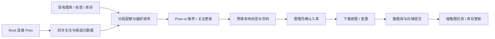

# Pixiv-ol 功能设计方案

日期：2026-10-03。状态：首版已实现，真实账号连接与推荐/关注读取已验证；后续高级功能仍为设计。

关联事项：[数据库与前端重构清单](refactoring-roadmap.md)。本文记录完整目标，当前交付范围与运行限制见 [首版使用说明](pixiv-ol-usage.md)。标签页、账号连接、关注同步、混合推荐和入库任务已经接入。

本轮实现调整：分组优先级改为按库存自动计算；增加画师元数据、Pixiv 校验和标准投稿页 PID；详情图片区与信息区为两个独立卡片。下文旧的手动优先级设计由 [图库校验说明](library-validation-and-mappings.md) 和当前使用说明替代。

2026-10-03 补充：[推荐与数据挖掘方案](pixiv-ol-recommendation-design.md)。采用 Pixiv 候选与本地分层画像结合，区分 App 推荐与 Web 发现；本篇基础范围和权限继续适用，候选预算、画像及细化排序以补充方案为准。

2026-10-03 页面与流程调整：主导航只保留推荐和关注更新，“未入库”改为购物车式入口，原图先缓存到 temp，再确认标签并批量提交入库。账号、推荐偏好和映射移至全局设置；登录使用 Pixiv 本站 OAuth 页面，本机浏览器可自动接收授权，远程环境采用手动授权结果。具体以 [使用说明](pixiv-ol-usage.md) 为准，下文旧页面与 Token 输入方案已被此流程替代。

## 1. 已确认范围

用户已确认：

1. Root 绑定一个 Pixiv 账号，Root 和管理员使用 Pixiv-ol；普通用户和游客不开放。
2. “图库里图片少的占比更大”主要按 **作品/IP 分组库存** 衡量，角色用于细化，特征标签用于推测偏好。

这里的“作品/IP 分组”对应现有 `Group`，例如一个游戏或动画系列；Pixiv 的一条投稿另称“投稿作品”，避免把两种“作品”混为一谈。

首版目标：从现有图库、分组和标签建立可解释的推荐；读取关注作者的新投稿；自动提出本地标签；让管理员确认后下载并入库。页面名称固定为 **Pixiv-ol**，建议路由 `/pixiv-ol`。

本方案依据当前项目的数据模型和源码制定；当前推荐使用规则与统计画像，尚未训练学习排序模型。真实账号连接及推荐/关注接口已完成本机联调。

## 2. 可复用开源项目与选择

截至本次调研，可直接复用的主要是 API 客户端、授权辅助和下载工具。没有从这些已核查项目中找到能直接完成“本地图册库存平衡 + 现有标签映射”的成套功能，该部分由 PicManager 实现。

| 项目 | 已核查能力 | 许可证 | 本项目用途 |
| --- | --- | --- | --- |
| [PixivPy3 / upbit/pixivpy](https://github.com/upbit/pixivpy) | Refresh Token 认证、关注用户列表、关注新作、标签搜索、相关推荐、账号推荐、投稿详情 | [Unlicense](https://github.com/upbit/pixivpy/blob/master/LICENSE) | **首选后端 API 适配器**；封装调用和数据格式，避免业务层绑定其原始响应 |
| [gppt / get-pixivpy-token](https://github.com/eggplants/get-pixivpy-token) | 当前源码和 README 提供 OAuth2 PKCE 交互登录、Token 获取及刷新 | MIT | **首选本机授权辅助**；采用 `oauth_login()` 交互流程，在 Pixiv 页面登录后提供授权码 |
| [gallery-dl](https://github.com/mikf/gallery-dl) | Pixiv OAuth、投稿与关注流提取、元数据和批量下载 | GPL-2.0 | 授权辅助和下载工具备选；首版业务客户端不引入其代码。项目 README 已说明开发迁移至 [Codeberg](https://codeberg.org/mikf/gallery-dl) |
| [PixivUtil2](https://github.com/Nandaka/PixivUtil2) | 按投稿、作者、标签下载，关注作者新作下载和自身数据库管理 | [BSD-2-Clause](https://github.com/Nandaka/PixivUtil2/blob/master/LICENSE) | 批量下载流程参考；它自身的数据库与当前图库重叠，不作为主业务组件 |
| [piglig/pixiv-token](https://github.com/piglig/pixiv-token) | 浏览器自动化登录、Token 缓存和刷新 | MIT | 浏览器授权体验备选；先验证真实账号流程，再考虑接入 |

推荐组合：**PixivPy3 + gppt 的本机交互授权 + PicManager 自己的推荐、标签和导入服务**。

能力依据：[PixivPy3 API 源码](https://github.com/upbit/pixivpy/blob/master/pixivpy3/aapi.py)、[gppt 授权源码](https://github.com/eggplants/get-pixivpy-token/blob/main/gppt/oauth.py)、[gallery-dl Pixiv 配置](https://gdl-org.github.io/docs/configuration.html#extractor-pixiv-refresh-token)。PixivPy3 已取消直接用户名/密码登录，应使用 Refresh Token。

这些是第三方客户端所封装的 App/Web 接口，不应宣称为 Pixiv 面向本项目承诺稳定的官方集成接口。进入实施阶段先固定经过验证的依赖版本，并做实际登录、分页、详情和下载验证。gallery-dl 的 Codeberg 页面在本次浏览工具中未能成功打开；迁移信息来自其 GitHub README，不能据此宣称已核验 Codeberg 的最新代码。

## 3. 页面与操作流程

页面级标签页为 Pixiv-ol，内部包括：

| 内部页签 | 展示与交互 |
| --- | --- |
| 为你推荐 | 综合补图/Pixiv 优先模式；按分组库存调度；可查看平台返回顺序并明确停用库存平衡；显示推荐理由、匹配标签、库存和入库状态 |
| 关注更新 | 按发布时间展示关注作者新作；默认时间顺序，可切换“优先补图”排序 |
| 待入库 | 待补标签、多页选择、查重待决定和导入失败的条目 |
| 偏好与映射 | 分组优先级、屏蔽项、补图强度、标签映射和推荐解释；全局规则由 Root 管理 |

顶部提供账号连接状态、最近成功同步时间、刷新、同步进度和 Root 的账号设置入口。管理员可查看账号昵称和连接状态；凭据配置仅 Root 操作。

筛选项包括本地分组、角色、特征、作者、来源、发布时间、年龄级别、是否 AI 生成、是否已入库，以及“只看库存偏少分组”。

卡片至少显示：预览、投稿标题、作者、PID、页数、时间、本地匹配标签、分组库存、推荐理由和来源。操作包括详情、入库、稍后处理、不感兴趣和打开 Pixiv。已入库投稿显示“已收录 x/y 页”，允许仅补缺页。

详情采用原有视觉风格，分为图片区、本地标签区和 Pixiv 原始标签区。多页投稿有页码选择，可逐页调整角色与特征标签。投稿级标签只是默认建议，不能保证每一页包含同样角色。

典型流程：



## 4. 按分组库存平衡的推荐

### 4.1 将库存与喜好作为不同信号

库存少说明需要补充，不能直接推断“特别喜欢”；库存多也不等于应该完全停止推荐。系统先判断候选是否符合兴趣，再对符合兴趣的内容安排补图占比。

推荐集合只包含 Root 启用的分组。默认候选为图库已有有效图片的分组；空分组由 Root 主动启用并配置 Pixiv 查询词，避免测试分组、临时分组因库存为零而占满推荐。

对于每张 `available` 图片，若关联 k 个分组，给每个分组贡献 `1/k` 的有效库存，防止跨作品图片重复计算。面板同时显示实际图片数和用于配额的有效库存。已删除、缺失、归档、待审核的图片不计入；推荐反馈按投稿作品去重，避免多页漫画成为过强喜好信号。

### 4.2 配额公式

首版使用易理解、可调整的公式：

```text
n(g) = 分组有效库存
a(g) = Root 设置的分组优先级，默认 1，排除时 0
p(g) = 偏好修正，首版限制在 0.5～2 之间
λ    = 库存平滑项，默认 5
α    = 补图强度，默认 0.5；0 表示关闭库存平衡

b(g) = 1 / (n(g) + λ)^α
b'(g) = min(b(g), 4 × min(b(启用分组)))
w(g) = a(g) × p(g) × b'(g)
q(g) = w(g) / Σw(启用分组)
```

默认对库存造成的倍率设上限 4 倍，防止极端小库分组挤占所有位置。多分组候选只归入一个最需要补图的主分组分配名额，其余匹配分组仍保留。采用配额轮转和缺口补偿，不能把“标签多”当成获取更多配额的方法。

例如偏好和优先级相同时，分组 A/B/C 库存为 5/25/100，默认配置下理论推荐配额约为 **53% / 31% / 16%**。这是推荐列表配额示例，不是对真实 Pixiv 供给的保证。相关作品不足时向其他启用分组借用名额，记录未满足配额；不会为凑数量加入明显不相关作品。

### 4.3 偏好画像

初始画像使用现有分组、角色与特征标签：

- 统计图库中的特征频率、标签组合和角色关联，区分分组/角色标签与一般视觉特征。
- 当前系统会继承角色特征到图片，首版对这类可能继承的特征降低权重，避免所有角色图都带某特征后误判为强偏好。
- 分组画像宏平均、小样本平滑并与候选背景对比；图库高频标签可能是喜好，不直接按图库 IDF 降权。背景不足时使用平滑频率，避免大分组完全决定偏好。
- Root 的“喜欢、确认入库、调整优先级、不感兴趣、屏蔽作者/标签”提供后续反馈。普通跳过和下载失败不作为负偏好。
- 多名管理员共同改变图库库存；Root 的显式反馈用于共享推荐画像，其他管理员的隐藏/稍后处理默认只作用于本人界面。
- 初期已有标签不足时，依赖分组和角色；后续可增加本地视觉向量检索帮助发现未标注特征，但不作为首版依赖。

管理员可以看到画像依据并由 Root 手动调权重、撤销反馈和重新生成画像。

详见 [补充设计](pixiv-ol-recommendation-design.md)：区分人工/继承/外部标签证据，投稿级去重，建立全局/分组/近期画像。现有全站浏览与角色查询汇总不当作 Root 的个人画像。

### 4.4 候选获取与排序

更新后的综合模式候选获取预算为 40% Pixiv App 推荐/可选 Web 发现、35% 分组/角色/特征查询、20% 馆藏明确 PID 的相关推荐、5% 关注新作。这里是候选数量预算，最终列表按库存配额调度；来源不可用可降级，详见 [推荐补充设计](pixiv-ol-recommendation-design.md)。

按分组配额获取候选，避免先抓满大分组再尝试重排。分组使用中文名、别名和 Root 确认的日文 Pixiv 查询词；不假设中文标签都能直接搜到对应日文作品。

候选先经过分组相关性、屏蔽项、分级和可见性过滤，再在分组内排序。起始评分可设为：

```text
score = 0.40 × 分层偏好匹配
      + 0.25 × 本地分组/角色相关性
      + 0.15 × Pixiv 来源顺序参考
      + 0.10 × 新鲜度
      + 0.05 × 同投稿时间段热度参考
      + 0.05 × 分组内角色覆盖缺口
```

这些系数是可验证的初始参数，不是假定已经学习到用户偏好。质量参考采用对收藏数的平滑/对数处理，并区分投稿时间，避免新作因收藏尚少而全部被淘汰；不使用会员专属热门排序作为必要功能。

各分量归一化；缺失项取中性值并按置信度降低权重。多样性在配额内重排。Pixiv 来源顺序只是有限参考，不能当成可见的个人偏好概率；App 推荐不保证与网页发现页相同。查看平台返回顺序时明确停用库存配额，其余权限/过滤/标签建议继续适用。

同一投稿去重，同作者在一页内默认最多 2 条，角色连续重复适当降权；这些是软上限，候选不足时可放宽。理由示例：“所属分组库存较少；命中你常用的特征标签；来自关注作者的新投稿”。

支持三种模式：补图优先（默认）、偏好优先（降低 α）、探索（提高多样性预算）。画像、库存、映射和排序版本变化时更新下一批；正在浏览的分页结果固定在推荐批次内，避免翻页时出现重复和遗漏。

## 5. 账号连接与关注更新

### 5.1 首版连接方式

Root 在自己的电脑通过交互授权工具登录 Pixiv，再将得到的 Refresh Token 通过 Root 专用表单连接到 PicManager。页面提供清楚的本机授权引导；如使用 gppt，应优先采用不托管账号密码的 `oauth_login()`。输入密码和验证码发生在 Pixiv 登录页面。

Root 点击“测试并连接”后，后端交换 Token，验证账号身份并保存连接信息。Refresh Token 与 Cookie 不是同一种凭据；现有 `PIXIV_COOKIE` 继续用于现有 Web 高清补全逻辑，新功能单独管理 App API 凭据。

后续可以提供更完整的“打开 Pixiv 登录 → 提交授权码”图形化 PKCE 引导。该方式需保存一次性、短时、绑定 Root 会话的 code_verifier，并使用 Pixiv 实际支持的回调方式；不能直接假定 Pixiv 会接受任意 PicManager 网站 callback。授权码不放 URL 查询串，相关日志不记录 code 或 Token。

Root 可以重新连接、测试、解除绑定。账号失效时保留本地候选数据、显示需重新连接，并暂停继续请求；更换账号后清理旧账号的私有候选、同步游标和前端缓存。

### 5.2 凭据与权限

- 后端加密保存 Refresh Token，使用独立部署密钥；API 不返回明文，前端不存入 localStorage。数据库快照只含密文，解密密钥单独保管。
- Token 刷新使用账号级锁与凭据版本，原子保存刷新结果，避免多个任务互相覆盖。
- Pixiv-ol 所有 API、候选详情、缓存预览及任务进度均检查管理员权限；连接和全局偏好设置检查 Root 权限。
- 后台任务执行和最终入库前重新检查发起者权限及账号版本；撤销管理员权限或更换账号后，旧任务停止，不继续使用旧凭据或提交图片。
- 账号连接、授权码提交和入库等 Cookie 写操作增加 Origin/CSRF 校验；日志仅记录脱敏状态。
- 候选和预览不暴露到公开静态目录，响应使用 private/no-store；入库后按现有图库规则分发。

### 5.3 增量同步

使用 `user_following()` 获取关注作者列表，使用 `illust_follow()` 获取关注新作。公开/私密关注分别处理分页与游标；私密关注是否同步由 Root 在设置中选择。

建议默认关注新作每 30 分钟同步一次，关注列表每日更新一次，并支持手动刷新。手动与定时刷新复用同一在途任务。首轮先读取近 7 天，历史回补作为单独任务，不把全部作者历史塞进首次加载。

为防漏图：

1. 分页直到越过成功水位线与 48 小时重叠窗口，投稿身份去重后写入。
2. 每批成功写入后保存可恢复的进度；只有完整本轮同步成功才推进完成水位线。
3. 失败、限流或达到分页预算时标记“部分完成”，保留续跑位置，不能宣称已抓取全部新作。
4. 关注列表未完整同步时不删除旧关注记录；完整成功后才标记取消关注。
5. 新关注作者可以手动回补；时间线与推荐排序各有游标，互不覆盖。

“最新”表示账号接口当前可见的最新投稿，展示最近成功同步时间。推荐列表可以重排，关注时间线默认仍按发布时间倒序。管理员查看账号共用内容，个人已读、隐藏和稍后处理状态分别保存。

## 6. 自动匹配现有标签与一键添加 Pixiv 标签

### 6.1 匹配顺序

建立同时覆盖 `Group/GroupAlias`、`Character/CharacterNickname`、`FeatureTag/FeatureTagAlias` 的本地索引。Pixiv 标签保留原文和返回的译名，两者都用于匹配；不存在译名时不假设已经翻译。

规则优先级：

1. Root 已确认的 Pixiv 标签映射。
2. 规范化后本地名称或别名唯一精确匹配。
3. 在已识别分组内进行角色别名精确匹配。
4. 使用译名匹配；唯一且上下文一致时可预选。
5. 模糊、语义或视觉推断只列为待确认建议。

规范化采用 Unicode NFKC、去除首尾/多余空格及大小写归一；保留有意义的符号和上下文，避免过度清洗不同标签成为同一个词。同名角色属于不同分组时要求选择；未经确认的模糊结果不自动建组、建角色或修改角色的全局特征。

每个结果展示“目标类型、标签 ID、匹配依据、置信级别”。角色命中时可补入其现有分组和继承特征，并标注继承来源；多角色允许同时命中。

示例仅用于说明：某 Pixiv 日文作品标签映射到本地分组，角色标签映射到该分组中的角色，“白髪”经既有别名或人工映射对应“白发”。系统复用本地标签，不重复建立另一语言的新标签。

### 6.2 一键添加行为

详情同时展示四类：已匹配本地标签、尚未映射的 Pixiv 标签、分级/平台元数据、需要处理的冲突。

提供 **“一键加入 Pixiv 标签”** 按钮：已匹配的本地标签直接加入本次入库草稿，未映射标签列为“将新建的特征标签”，允许立即取消某项。管理员点击最终入库时，新标签创建与图片关联一并提交；只是浏览推荐不会修改全局标签库。

分组/角色标签已有映射时按其类型复用；未识别的作品/角色名称提示建立映射，也可由管理员明确选择作为普通特征保存。默认过滤 R-18/R-18G、收藏人数宣传标签、平台操作标签等不适合作为视觉特征的项，但全部原始标签仍保存在来源元数据中，可展开检查。

新标签默认优先使用原文；若有译名，可选择译名为本地名称、原文为别名。采用规范化去重和数据库唯一约束处理并发创建；匹配歧义需确认。人工纠正可以选择“记住映射”，后续同类投稿更准确。管理员可纠正当前草稿，全局规则由 Root 管理或接受管理员提交的映射建议。

分级、AI 状态和热度作为独立字段，不能混入特征偏好。外部分级指示受限的投稿按最低限制入库；R12/R16 由本地规则和管理员判断。R18G 默认单独过滤，只有 Root 明确启用后才进入候选，并保留原始限制字段，避免与普通 R18 混淆。

## 7. 一键入库、多页与查重

高置信标签完整的单页投稿可直接点击“入库”；未确定分组、标签冲突或多页选择未完成时进入详情补全。首版要求至少一个明确分组，角色可以为空，避免非角色图无法导入。

先创建导入任务，立即返回任务 ID；原图下载、内容验证和查重由后台执行。首版只浏览并选择导入，不自动批量收录整条推荐流。批量入库以管理员勾选条目为范围。

处理步骤：

1. 后端按候选 ID/PID 获取最新详情和选中页原图 URL，验证页码、可见性和分级。
2. 验证 `(pixiv, PID, page_index)` 来源身份是否已经入库，已存在页返回对应图库记录。
3. 下载到暂存文件，限制大小、超时、域名及重定向目标，检查内容并计算 SHA-256/dHash。
4. 字节哈希检测相同文件；视觉哈希用于提出相似候选，管理员决定。现有查重仅在有共同角色时扫描，新导入需要补上分组范围查重，角色为空也能发现相似内容。
5. 无冲突后，发布本地/R2 原图，提交图片、来源、选中标签、导入结果和派生任务。暂存源保留到提交成功；失败执行补偿，重试有幂等保护。
6. 相似图片进入“待决定”，提供保留已有、采用新图、合并信息、确认不同、稍后处理；等待期间不持有数据库事务。
7. 成功后更新分组库存、下一推荐批次与页面缓存；失败保留可重试任务，展示可理解的原因。

PID 保留原数字字符串；多页每页对应一张 Image，来源中保存 page_index。不能把 PID 设为图片表的唯一键，也不能仅因已有一页就隐藏整个投稿。

历史 PID 可能是自由文本或有多个同 PID 图片。迁移时只标记能确定的来源，不能凭空猜页码；页码未知时显示“可能已有”，用下载内容查重后再决定。原图升级沿用来源和页码，不创建第二份相同来源记录。

## 8. 后端结构、数据与 API

### 8.1 模块边界

建议新增：

```text
app/integrations/pixiv_ol/
  provider.py           # 第三方库适配、分页、身份与错误归一
  auth.py               # 凭据加密、账号连接、Token 刷新
  sync.py               # 关注列表、新作和候选抓取
  recommendations.py    # 库存配额、画像、排序与解释
  tag_mapping.py        # 名称索引、上下文匹配与人工映射
  importer.py           # 下载、查重、幂等入库与补偿
  jobs.py               # 持久任务与独立后台执行
app/routers/integrations/pixiv_ol.py
frontend/src/features/pixiv-ol/
```

现有 `app/pixiv.py` 是 Web API 高清补全客户端，不直接承担账号推荐。可以提取并复用可信图片 URL 校验、限量下载等能力，但不共用不明确的 Token/Cookie 头，也不让它依赖 Pixiv-ol 已启用。

Provider 统一提供 account_info、following、follow_feed、search、related、recommended、artwork_detail 和 pages；同步第三方调用在后台线程/任务执行，不阻塞 FastAPI 事件循环。前端只访问 PicManager API。

可选 Web Provider 另提供 discovery 与 Web 会话验证；与 App Token 分开管理并核对同账号。补充设计还定义标签证据、画像版本、真实曝光事件和画像重建 API。

### 8.2 表设计

| 表 | 核心字段与职责 |
| --- | --- |
| pixiv_accounts | 内部 account_id、Root owner_id、Pixiv user_id、昵称、加密凭据、凭据/账号版本、状态、同步时间；首版限制一个启用账号 |
| pixiv_follows | account_id、author_id、名称、公开/私密状态、是否仍关注、同步版本；唯一 `(account_id, author_id)` |
| pixiv_artworks | account_id、PID、作者、标题、发布时间、页数、原始标签/译名、分级、AI 状态、元数据缓存版本；唯一 `(account_id, PID)` |
| pixiv_artwork_pages | artwork_id、page_index、尺寸、缓存预览定位及过期时间；唯一 `(artwork_id, page_index)` |
| pixiv_artwork_origins | artwork_id、来源 feed/search/related/recommended、来源查询或种子 PID、发现时间；允许一个投稿有多个来源 |
| pixiv_artwork_user_states | artwork_id、manager_user_id、已读/隐藏/稍后；唯一 `(artwork_id, manager_user_id)` |
| pixiv_tag_mappings | Pixiv 规范标签、上下文、目标 group/character/feature/ignore、目标 ID、确认者、版本；校验目标存在，保留歧义信息 |
| pixiv_preferences | 账号范围的启用分组、查询词、优先级、屏蔽标签/作者、补图参数和画像版本 |
| pixiv_feedback | account_id、投稿/目标实体、反馈类型、actor_id、时间；区分明确偏好与普通操作记录 |
| pixiv_recommendation_batches / items | 固定批次、画像/库存/算法版本、排名、主分组和推荐解释，保证稳定翻页 |
| image_sources | image_id、provider、external_work_id、page_index、来源 URL、作者及入库元数据；明确来源唯一 `(provider, external_work_id, page_index)` |
| pixiv_jobs | 类型、去重键、actor_id、账号版本、状态、结构化 payload、页级结果、尝试次数、available_at、lease、错误；不存明文 Token |
| pixiv_sync_state | account_id、同步种类/公开私密流、当前分页进度、成功水位、最近成功与失败；唯一对应每条同步流 |

图片原图和派生图片仍由现有 Image/Storage 管理。候选只是缓存，不创建虚假的 Image 行，也不计入现有图库总数。来源页表保持分页定位，下载只在确认入库时进行。

元数据可先用 JSON 保存；需要 SQL 筛选和排序的账号、PID、作者、发布时间、分级、状态使用独立列。原始 API 字段进入内部分层 DTO，不能让第三方响应直接决定前端契约。

索引优先：候选 `(account_id, created_at, PID)`、作者 `(account_id, author_id, created_at)`、任务 `(status, available_at, id)`、同步身份唯一索引、来源唯一索引。新增数量要按实际查询计划控制。

### 8.3 API 草案

| 方法与路径 | 权限 | 功能 |
| --- | --- | --- |
| GET /api/pixiv-ol/account | 管理员 | 脱敏连接状态与最近同步时间 |
| POST /api/pixiv-ol/account/connect | Root | 校验并连接 Refresh Token，密文保存 |
| POST /api/pixiv-ol/account/test | Root | 连接健康测试 |
| DELETE /api/pixiv-ol/account | Root | 解除连接并失效私有缓存/任务 |
| GET /api/pixiv-ol/following | 管理员 | 本地关注作者分页 |
| POST /api/pixiv-ol/sync | 管理员 | 创建/复用同步任务，返回 202 和 task_id |
| GET /api/pixiv-ol/feed | 管理员 | 关注新作，时间游标分页 |
| GET /api/pixiv-ol/recommendations | 管理员 | 固定 batch_id 的推荐分页与理由 |
| POST /api/pixiv-ol/recommendations/refresh | 管理员 | 创建候选刷新与重排任务 |
| GET /api/pixiv-ol/artworks/{PID} | 管理员 | 缓存详情、选中页、本地匹配和来源 |
| GET /api/pixiv-ol/previews/{artwork_id}/{page_index} | 管理员 | 经服务器鉴权的预览，禁止公共缓存 |
| POST /api/pixiv-ol/artworks/{PID}/match-tags | 管理员 | 计算建议标签和冲突，不修改全局库 |
| POST /api/pixiv-ol/imports | 管理员 | 按 PID、页码、标签草稿和幂等键入队 |
| POST /api/pixiv-ol/imports/{task_id}/resolve | 管理员 | 处理重复或补齐导入信息 |
| GET /api/pixiv-ol/jobs/{task_id} | 管理员 | 进度与每页结果 |
| POST /api/pixiv-ol/feedback | 管理员 | 明确反馈或本人隐藏/稍后状态 |
| GET /api/pixiv-ol/preferences | 管理员 | 画像摘要和库存配额 |
| PUT /api/pixiv-ol/preferences | Root | 修改全局分组与推荐参数 |
| GET /api/pixiv-ol/tag-mappings | 管理员 | 分页查看确认映射 |
| POST/PUT/DELETE /api/pixiv-ol/tag-mappings... | Root | 管理全局映射；普通管理员可提交建议 |

建议响应码区分：401 会话失效、403 权限、409 元数据/映射冲突、外部连接错误与需要重连的具体业务状态。列表读取本地缓存；需要访问 Pixiv 的刷新、下载和修复使用任务，页面轮询进度即可，后期再增加 SSE。

## 9. 运行方式与异常处理

首次实现以单个 Pixiv 同步执行器和两个下载工作线程为起点；API 调用默认从约每秒 1 次加随机间隔开始，作为可调整的工程配置，而非 Pixiv 对外公布的限额。429 按 Retry-After/退避恢复；401 尝试一次受控刷新，失败即要求重连；403 区分账号验证、内容不可见与风控，避免无限重试。

建议起始缓存：候选元数据 24 小时、预览文件 7 天或存储预算内 LRU 清理；关注游标和来源身份持久保存，不能跟候选缓存一同误删。导入前重新读取详情，失效或不可见投稿保留原因并停止导入。

外部访问、下载、Pillow 处理、限速等待都在数据库事务外执行。任务以短事务领取并提交，持久化租约和有限重试；重启后可恢复，Token/授权信息不进异常原文或任务 payload。

使用现有 `PIXIV_PROXY` 与请求超时设置；API 和图片下载使用明确的目的域名边界，检查重定向。客户端不能传任意外部 URL 让服务器下载，不能将 API Token/Cookie 转发到图片 CDN。

多页任务记录逐页成功状态，后续只重试失败页；数据库最终唯一来源约束拦截不同管理员同时导入同页，冲突时返回已有 Image。对用户隐藏仅影响展示，作者/分组全局屏蔽由 Root 控制。

首版支持普通插画和漫画中的静态页。Ugoira 动画需要另加帧包与转换流程，可作为后续阶段；页面明确标注暂不支持。AI 过滤提供包含/排除/仅看，起始默认排除已明确标记的 AI 作品；未标注不能被宣称已经可靠识别。

## 10. 分阶段实现

| 阶段 | 交付 |
| --- | --- |
| 0：基础修复与 PoC | 完成事务/文件补偿/私有派生分发修复；验证 Token、关注分页、App 推荐与种子相关、详情、多页及下载；Web 发现独立可选验证 |
| 1：连接和关注更新 | Root 账号设置、持久同步、Pixiv-ol 标签页、管理员鉴权预览和关注时间线；先不依赖整站前端重写 |
| 2：标签与导入 | 自动映射、本地标签草稿、一键加入 Pixiv 标签、多页导入、来源身份、幂等与查重 |
| 3：推荐 MVP | 先 Pixiv 候选与库存配额，再按反馈优化分层标签画像、背景对比、搜索/相关混合、多样性与效果对照 |
| 4：迭代优化 | 按效果调权重、可选视觉向量、图形化 PKCE 引导、Ugoira、批量工作流与 SSE |

候选与领域 API 先定义好，前端可以在现有 JS 壳中临时接入；Vue 迁移时复用这些 API 和组件行为，不重复重写推荐规则。

## 11. 验收标准

1. 只有 Root 能配置或解除 Pixiv 账号；普通用户/游客直接访问 API、详情、预览和任务均被拒绝；响应、日志和前端缓存不包含 Token。
2. 关注列表和关注新作都能分页；刷新不会产生重复项；失败后重启可续跑；公开与私密关注不共用错误的游标。
3. 相关性、偏好与优先级相同、供给充足时，小库存分组得到更大配额；配额与有效库存符合公式，不随一条投稿标签数量增加。
4. 库存平衡开关 α=0 时不再按库存分配；排除分组、缺候选和零库存分组行为符合明确规则。
5. 精确名称/别名和确认映射能预填；同名角色、翻译歧义和模糊建议不会静默成为确定标签。
6. “一键加入 Pixiv 标签”复用已有项，创建选中未映射项；分级/平台元数据保留来源信息且不误计入视觉偏好；并发创建不产生重复标签。
7. 同 PID 不同页可以分别入库；同页并发/重试只有一份来源和 Image；历史页码未知的 PID 不导致整条投稿误隐藏。
8. 原图下载、远端错误和数据库锁时可恢复，不因误判删除已有图库记录；补偿及每页重试不破坏暂存源。
9. 没有角色、只有分组的候选可以导入，并能在分组范围查重；相似哈希只提示，最终处理需要管理员明确决定。
10. 爬取/导入任务运行时，图库搜索、登录、上传与编辑继续可用；完成后图片、来源、标签、任务和库存状态一致。
11. 关注时间线默认时间顺序，推荐分页批次稳定；最近同步时间和部分完成状态真实显示。
12. 真实账号 PoC 的结果、依赖版本和接口样本单独归档；单元测试使用脱敏 fixture，真实 Token 不进入仓库。

## 12. 参考资料与验证边界

- [PixivPy3 README：认证与可用 API](https://github.com/upbit/pixivpy)
- [PixivPy3 App API 源码：follow、related、recommended、search](https://github.com/upbit/pixivpy/blob/master/pixivpy3/aapi.py)
- [PixivPy3 模型：标签译名、多页、分级和 AI 字段](https://github.com/upbit/pixivpy/blob/master/pixivpy3/models.py)
- [gppt README：交互 PKCE、Token 与刷新](https://github.com/eggplants/get-pixivpy-token)
- [gppt OAuth 实现](https://github.com/eggplants/get-pixivpy-token/blob/main/gppt/oauth.py)
- [gallery-dl 项目与开发迁移说明](https://github.com/mikf/gallery-dl)
- [gallery-dl Pixiv 授权、标签和下载配置](https://gdl-org.github.io/docs/configuration.html#extractor-pixiv-refresh-token)
- [PixivUtil2 功能说明](https://github.com/Nandaka/PixivUtil2)
- [PixivUtil2 许可证](https://github.com/Nandaka/PixivUtil2/blob/master/LICENSE)
- [piglig/pixiv-token](https://github.com/piglig/pixiv-token)

上述开源能力来自当前可读取的项目文档、源码和许可证，推荐排序、配额、同步参数及产品交互均是本项目的设计建议，尚未通过真实账号或生产图库验证。
