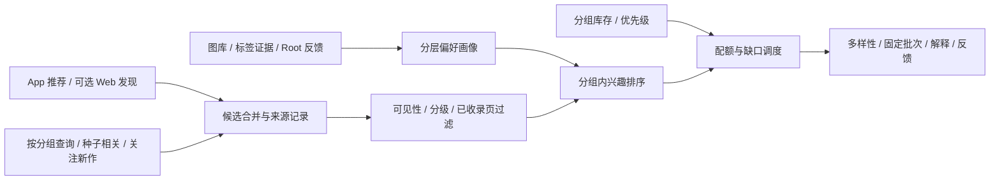

# Pixiv-ol 推荐与数据挖掘补充设计

更新日期：2026-10-03。状态：规则与统计推荐首版已接入，真实账号连接及推荐/关注读取已验证，尚未训练学习模型。当前实现及待办见 [首版使用说明](pixiv-ol-usage.md)。关联 [主设计](pixiv-ol-design.md)。本文件描述完整推荐目标；Root 单账号、管理员使用、主要按作品/IP 分组库存补图的范围保持不变。

当前配额由分组库存自动计算，不再使用手动优先级；已知投稿的多个页合并计数，Pixiv 来源标签不作为偏好信号。下文尚存的手动优先级描述属于旧方案，以使用说明和当前实现为准。

## 1. 推荐决策

采用 **Pixiv 推荐提供候选 + 本地图库挖掘判断兴趣 + 分组库存安排补图 + 多样性重排** 的混合方案。先用规则和统计模型，积累明确反馈后再学习排序，不以首版训练复杂推荐模型为前提。

Pixiv 能利用平台侧信息发现新作者和新内容；PicManager 能判断已收录页、标签映射和各分组库存。结合后既能发现未想到的作品，又能补充偏少分组。仅照搬平台顺序不能实现库存平衡；仅按库存或标签频率排序容易推荐重复内容。

“偏好判断”和“入库标签”采用不同门槛：推荐允许弱信号帮助召回，入库仍遵守高置信预选与歧义确认，不把推测写成确定标签。

## 2. Pixiv 发现页与 App 推荐

### 2.1 已核查事实

| 来源 | 已核查内容 | 设计影响 |
| --- | --- | --- |
| [Pixiv 官方：发现标签页](https://www.pixiv.help/hc/en-us/articles/34189864850073-About-the-Discover-tab) | 包括与浏览历史相关的标签、热门标签、创作者推荐及 pixivision 内容 | 发现页不是单一的个性化图片列表 |
| [Pixiv 官方：主页内容](https://www.pixiv.help/hc/en-us/articles/34188915837849-What-kind-of-works-are-displayed-on-the-Home-tab) | 结合浏览历史与热门内容；该说明明确主页不展示年龄受限作品 | 不根据主页供给推断整个 Pixiv 库存或账号分级设置 |
| [PixivPy3 当前源码](https://github.com/upbit/pixivpy/blob/master/pixivpy3/aapi.py) | 登录 `illust_recommended()` 调用 App `/v1/illust/recommended`，另有非登录入口 | 首版复用账号 App 推荐，不能承诺等同网页发现页 |
| 同一 PixivPy3 源码 | `bookmark_illust_ids` 仅在 `req_auth=False` 分支写入请求 | 登录推荐不能靠填本地 PID 定制；本地种子使用 `illust_related()` |
| [AgMonk/pixiv-utils](https://github.com/AgMonk/pixiv-utils) 与 [PixivNow 接口记录](https://github.com/FreeNowOrg/PixivNow/blob/master/docs/pixiv-web-api.md) | 记录 Web `GET /ajax/discovery/artworks` 与登录 Cookie 使用方式 | 是 Web 接入线索，参数/返回需真实账号验证；不是官方稳定 API 契约 |

### 2.2 首选 App，Web 作为可选试验

首版使用 PixivPy3 账号推荐，沿用 Refresh Token；分别读取插画/漫画，保存返回顺序、来源批次及分页参数。非登录来源若作为降级，必须明确标识，不能伪装成 Root 的个性化推荐。

保留可选 `web_discovery` Provider。Root 单独连接加密保存的 Web Cookie，核对 Web 用户 ID 与 App 绑定用户 ID；不自动把现有 `PIXIV_COOKIE` 视为已验证的同账号凭据。Token 不能代替 Web Cookie。

后端只读取发现候选，不嵌入整个 Pixiv 页面。摘要缺字段时只给需要展示/排序的条目补详情；原图仍在确认入库后下载。广告、无有效 PID、小说和首版不支持的动图不进入静态图片候选。

Web 接口可能返回新批次而非稳定分页。只使用实际响应中验证过的分页协议；无游标时按批次缓存与 PID 去重，连续重复或达到本轮请求预算就停止，不能假设不断刷新能无限翻页。

Web 会话失效、风控或结构改变时只暂停该来源，继续使用 App、搜索和相关作品。页面显示各来源状态，沿用主设计的凭据保护、域名限制、短事务及账号版本检查。

### 2.3 提供器验证事项

- 出站请求测试确认参数真正发送。当前 PixivPy3 对 `include_ranking_illusts` 使用真值判断，布尔 `False` 会省略该参数；若服务端验证支持，适配器可用非空字符串 `"false"` 表达关闭。最终通过响应确认是否混入榜单。
- `next_url` 只解析白名单分页参数，不直接请求任意返回 URL；推荐刷新产生新批次，不假设旧偏移稳定重放。
- 无论远端提供何种过滤，本地再核对 AI、分级和可见性；字段缺失标为未知，不当成通过过滤。
- PicManager 的反馈只更新本地画像，不自动向 Pixiv 收藏、点赞、关注、发送不感兴趣或模拟浏览来训练账号。

## 3. 流水线



主分组需有确认映射、明确角色上下文或其他可靠依据。从某分组种子查到只是弱关联，不能直接占该分组补图名额。分组未知的推荐进入“探索待归类”，不编造分组或库存理由。

## 4. 数据挖掘：分层画像

### 4.1 证据与统计单位

当前 `ImageService._apply_tag_relationships()` 将角色分组和特征并入图片；关联表没有逐标签来源。`ImageViewCount`、`CharacterQueryCount` 是全站汇总，不能追溯行为是否属于 Root。首版不把这些汇总计数当作个人偏好。

| 数据 | 处理 |
| --- | --- |
| Root 明确喜欢/不感兴趣、手动优先级 | 最可信，按选定目标范围生效 |
| Root 确认入库 | 中等正信号，不认为所有附带标签都被喜欢 |
| 历史图库与已确认标签 | 初始馆藏证据，低于显式偏好；其他管理员入库只视为馆藏证据 |
| 角色固有或疑似继承特征 | 主要识别角色，低权重参与跨分组视觉偏好 |
| 未确认的 Pixiv 原始标签 | 保存来源，先不作为训练真值，避免自我强化 |
| Root 打开详情 | 弱信号，仅短期使用并封顶 |
| 全站计数、未点击、下载失败 | 不作为 Root 喜欢或不喜欢的证据 |

画像以“投稿作品/确认重复簇”为单位：同 PID 多页合计一个单位；历史无明确来源时按可靠哈希/人工确认簇处理，否则独立计数。dHash 近似只提供重复建议，不强行合并训练样本。

一个单位涉及 k 个分组，各贡献 1/k；标签仅出现于部分页时按覆盖率给弱证据，避免一页代表全稿。库存仍按有效 Image 数统计，画像单位不替代库存单位。

新增 `tag_evidence`：image_id、tag_id、source、confidence、confirmed_by、source_version。来源区分 manual、character_inherited、pixiv_mapped、pixiv_unmapped、visual_inferred；一条关系可有多种证据，组合可靠证据后封顶，不重复累加。

历史无法恢复来源时，仅标“疑似继承”：与当前角色特征重叠的标签初始置信权重 0.25，其余未知来源 0.6，确知管理员主动选择的为 1.0。是可调估计，不是来源事实；角色定义改变触发重算。

### 4.2 三层画像与小样本平滑

分开保存全局风格、分组内偏好和近期兴趣。全局先算各启用分组的归一化画像再宏平均，避免大分组垄断。分组内保存角色、作者和特征，避免某 IP 的偏好套到所有 IP。

少样本分组向全局画像收缩：

```text
rho(g) = m(g) / (m(g) + 20)
P(t | g) = rho(g) × P_local(t | g) + (1-rho(g)) × P_global(t)
```

m(g) 为独立画像单位的有效权重，20 是初始先验强度；手动优先级独立于统计估计，不被收缩覆盖。

近期画像使用 Root 最近 90 天明确反馈，初始半衰期 30 天；长期馆藏保留。`Image.created_at` 是本地入库时间，可能是批量迁移时间，不直接当成喜欢时间或 Pixiv 发布时间。

### 4.3 标签偏好用背景对比

“白发”在馆藏中高频可能恰好说明喜欢白发，不能因为高频就按馆藏 IDF 大幅降权。比较同分组、分级与来源结构的馆藏和候选背景：

```text
P0(t | g) = 分层候选背景中标签 t 的平滑占比
P_positive(t | g) = (c(g,t) + beta × P0(t | g)) / (m(g) + beta)
enrichment(g,t) = clip(log((P_positive(t | g)+eps)/(P0(t | g)+eps)), -2, 2)
```

c 为标签有效正证据，m 为有可比较标签覆盖的有效单位数，beta 初始 20，eps 防数值问题。映射覆盖低、标签稀疏时降低画像置信度；缺标不是确定“没有该特征”。

背景从已取得候选分层抽样，不额外大规模抓取。每组至少 50 个独立可比较候选再启用；不足时用平滑频率与手动偏好。固定背景来源比例并记录版本，不把候选池说成整个 Pixiv 总体分布。

例如馆藏 60% 带白发，候选池只有 20%，它可以成为偏好线索；两边都 90% 的通用标签区分度低。馆藏没有某标签只是缺少正证据；负 enrichment 仅作有限相对调整，强负偏好须来自明确反馈。

再乘标签可信度，避免“收某个白发角色很多图”直接等价于“跨作品喜欢所有白发”。Root 明确喜欢该特征时可提升跨组权重。

### 4.4 标签组合与后续视觉特征

首版只挖两两组合，例如白发+制服。至少 10 个独立投稿、3 名已知作者、不同时间批次，才作为稳定建议；不足则低置信。计算平滑组合提升度、按支持度向 1 收缩，排除分组→角色、角色→固有特征等结构性共现，每组最多保留 20 个组合。

查询先用 Root 确认的日文分组词，再轮换角色、单特征或可靠组合；供给少逐步放宽附加特征。不要求所有偏好标签同时命中，不自动合并互斥标签形成无效查询。

标签方案稳定后，可对本地图和授权预览提取视觉向量，补充构图、色彩与风格相似度。模型的二次元适用性、许可证与 CPU 耗时先小样本比较再选；小数据量先做后台批量比较，不强制 GPU 或向量数据库。

视觉模型/尺寸/向量版本保存。相似度是排序特征，不是角色、年龄或作者的确定判断。缺标时降低置信度，不能用通用文本模型编造标签补齐画像。

## 5. 候选与排序调度

### 5.1 更新的获取预算

| 来源 | 综合模式候选数量预算 | 用途 |
| --- | --- | --- |
| App 推荐 / 可选 Web 发现 | 40% | 平台发现新作者与兴趣；Web 未启用全部给 App |
| 分组/角色/特征搜索 | 35% | 定向补少图分组 |
| 馆藏明确 PID 的相关作品 | 20% | 以不同分组的代表稿扩展 |
| 关注新作 | 5% | 综合候选补充；独立关注页不受此比例限制 |

这是候选数量预算，不是最终页面或请求次数占比。另设请求/耗时上限，同 PID 多来源只算一个候选、保留全部来源。相关种子按分组分层、限制同作者，轮转可靠 PID，不连续围绕最大分组或刚入库一张图扩展全库。

平台候选偏向大库时先增加小库搜索/相关预算，再重排。来源失效或重复率高可在本轮上限内转移预算并记录原因，不为达到数量无限刷发现接口。

### 5.2 库存配额、相关性与未知分组

沿用主设计平方根倒数库存权重、平滑 5、倍率上限 4。库存 5/25/100 仍约为 53%/31%/16%；20 张页面采用最大余数分配约为 11/6/3。

调度顺序：硬过滤 → 可靠主分组 → 组内相关性 → 整数配额 → 组内高分 → 多样性。多分组稿归入本批次缺口最大的可靠组一次，不重复占名额。

相关性门槛先依靠明确分组/角色和屏蔽规则，初始分数仅表示相对顺序，不当成校准概率。库存少也不能越过门槛；供给少先有限定向补召回、放宽附加特征，再借其他启用组名额并显示缺口。

未知组探索项在综合模式最多占 10%，标“不计入分组补图”；分组配额对剩余已归类名额生效。Root 可设为 0。已浏览批次固定，入库只更新下一批库存。小组得到更多曝光不自动成为更强喜好证据。

### 5.3 分组内评分与多样性

各分量归一化至 [0,1]，初始规则为：

```text
R(i | g) = 0.40 × 分层偏好匹配
         + 0.25 × 分组/角色相关性
         + 0.15 × Pixiv 来源顺序参考
         + 0.10 × 新鲜度
         + 0.05 × 同投稿时间段热度参考
         + 0.05 × 分组内角色覆盖缺口
```

缺画像取中性值并减少该项权重、转给明确相关性，不能归零淘汰候选。Root 硬屏蔽在评分前执行。排序系数是待验证初值。

Pixiv 参考来自对应批次原始排名，可用有界 `1/log2(rank+1)`；不是平台喜欢概率。非平台推荐来源取中性先验，同稿多来源不累加奖励。新鲜度取 Pixiv 发布时间；热度在同时间段、类型和分级做稳健分位归一并封顶，缺字段取中性值，避免小众 IP 和新作因绝对收藏数低被排除。

角色覆盖缺口只占 5%，不改变主要按 Group 补图。选择时加入类似 MMR 的重复惩罚，首版使用加权标签 Jaccard、同作者/角色/确认重复簇，以后加入视觉相似。

重复惩罚在同组配额内比较；每页同作者默认最多 2 条，供给少可放宽软限制。关注时间排序和单作者筛选不套用该限制；硬屏蔽和来源页去重始终执行。

## 6. 反馈学习

| 操作 | 初始处理 |
| --- | --- |
| Root 喜欢 | 权重 2，可选择喜欢画面、角色或作者 |
| Root 确认入库 | 权重 1，受标签证据和入库原因限制 |
| Root 打开详情 | 权重 0.1，每 PID 每日一次，只影响短期 |
| Root 不感兴趣 | 默认该投稿 -2，可明确选择具体角色/作者/特征范围 |
| Root 屏蔽 | 只作用于明确目标，不扩散至投稿所有标签 |
| 管理员隐藏/稍后、失败、未点击 | 个人状态或未知，不改变共享喜好 |

同 PID 喜欢与入库相关，默认取最强有效正信号，不无限叠加；多页、重复点击和任务重试不放大。撤销反馈后重算，保留审计版本。其他管理员改变库存，但其行为不作为 Root 的显式喜好。

记录真实曝光（卡片进入视口达到约定时长）、详情打开、请求入库和成功入库。下发候选不算曝光；事件记录 actor、账号版本、batch、PID、来源、排名、实验版本与幂等 ID。成功入库允许延迟归因，按事先约定窗口评估。

防自我强化：分组宏平均、小样本平滑、同稿封顶、明确反馈优先、库存独立调度、保留探索。未经确认的自动 Pixiv 标签不进入训练真值，否则会持续放大原来的映射错误。

一个 Root 账号不足以从零训练可靠多用户协同过滤。先规则/统计；积累约 200 个独立投稿级明确反馈，且覆盖多个分组、来源及正负信号后，试带 L2 正则的逻辑回归或成对排序并与规则比较。200 只是试验准入参考，不是效果保证。

未点击仍不是负例。曝光用于覆盖与分母；后期如做选择概率校正，先记录可解释的随机探索概率，不能用确定性日志假装无偏估计。来源预算先手调，后续只在约 10% 探索预算试验带先验的多臂老虎机，保留分组配额、最低来源预算和请求上限。

## 7. 页面、接口与表结构补充

来源模式和排序分开：

- **综合补图（默认）**：本次混合候选、库存配额和本地排序。
- **Pixiv 优先**：平台候选初始 70%，搜索 15%、相关 10%、关注 5%；仍做库存配额。可选 App/Web 来源。
- **查看 Pixiv 返回顺序**：仅选定平台来源、保留批次顺序；仍做权限/分级/屏蔽/去重/标签预填，明确提示“此排序不做库存平衡”。没有可靠顺序不能标为原始顺序。

原有补图/偏好/探索强度保留；来源模式决定从哪里获取，强度决定如何分配。平台理由不可见时只说“来自 Pixiv 推荐”，不编造平台对用户喜好的判断。

可解释理由例如“App 推荐候选；分组仅 8 张；命中确认别名；与馆藏标签相近”，并展示画像置信度与配额缺口。

| API 补充 | 行为 |
| --- | --- |
| GET /api/pixiv-ol/recommendations?mode=...&order=...&batch_id=... | 固定批次、来源、主组、分数分解、画像置信度与缺口 |
| GET /api/pixiv-ol/recommendation-profile | 管理员查看有效样本、强标签/组合、继承疑似项与近期/长期依据 |
| POST /api/pixiv-ol/recommendation-profile/rebuild | Root 创建重建任务，完成发布新版本 |
| POST /api/pixiv-ol/events | 管理员鉴权，限量/幂等写真实事件；Root 才参与共享画像 |
| POST /api/pixiv-ol/account/web-connect | 可选 Root Cookie 连接，验证同账号、加密保存 |
| POST /api/pixiv-ol/feedback | 增加 scope、target_type、target_id、可撤销状态 |

新增 tag_evidence、recommendation_profile_versions、recommendation_events。标签证据与图片关系共事务，画像版本记录算法/背景/映射版本和样本水位；后台增量或按组重算，列表请求不全表聚合。

批次保存模式、预算、候选身份、评分分解、主组/配额、模型/映射/库存版本和生成时间，恢复不依赖接口重复返回同一批。逐曝光明细按有限期限汇总，不无限保留。

## 8. 效果验证与实施顺序

比较 A 仅 Pixiv 来源顺序、B 同来源加库存配额、C 混合来源加分层画像/配额/多样性。先固定候选池比较排序，再单独比较来源；分级、屏蔽、已收录过滤与条目数量一致，避免同时改两层却错误归因。

| 指标 | 定义/作用 |
| --- | --- |
| 有效入库率 | 至少成功入库一页的唯一曝光投稿 / 唯一曝光投稿；多页和重复操作不重计 |
| 正/负反馈率 | 喜欢与不感兴趣分开；技术失败不算负反馈 |
| 分组覆盖/配额误差 | 对已归类名额比较目标与实际；供给缺口、探索份额单列 |
| 作者/角色覆盖 | 新作者率、重复作者率、薄弱角色覆盖，防止只推熟悉内容 |
| 标签质量 | 人工确认率、改标/歧义/新建重复率，不把排序分数当准确率 |
| 成本与稳定性 | 每有效候选请求数、缓存命中、429/失效、生成耗时与有效入库成本 |

Root 单账号初轮可标版本交错展示或按时间交替，保存来源、位置与分配。交错仅作探索性比较；小样本报告趋势与区间，不宣称严格因果或显著提升。

离线按时间切分，只用截点前可见图库、标签与反馈。确认重复簇和多页不跨训练/验证；未知身份报告可能泄漏。映射与背景版本固定，不用后来修正的标签偷偷改善历史验证成绩。

实施阶段：

1. **推荐 PoC**：验证 App 账号推荐、插画/漫画、实际参数、顺序、分页和馆藏种子相关。Web 验证 Cookie/同账号/结构/供给，失败不阻塞 App 首版。
2. **先可用**：Pixiv 候选 + 已收录过滤 + 标签预填 + 配额，建立原始顺序对照及事件记录。
3. **再挖掘**：标签证据、分层收缩、背景对比、组合、多样性；同候选池比较收益。
4. **后学习**：反馈充足后试轻量排序、视觉向量和来源探索，每阶段可按版本回退。

新增验收：登录推荐不会误称使用本地 bookmark_illust_ids 种子；Web/App 账号不一致拒绝连接；多页/多源不放大画像；继承标签与全站计数不主导 Root 画像；撤销/改映射可重建；缺标非负偏好；综合与 Pixiv 优先遵守配额，原始顺序明确停用；未知分组无虚假库存理由。

本补充的权重、先验、预算和样本阈值都是设计初值，需真实账号和实际图库验证。接口能力事实与效果假设分别记录；本次未抓取真实账号、自动收藏或训练画像。
